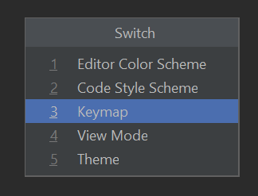

## The key(board) to success

* Keymaps
  * Different between macOS and other OSes
    * [macOS For All](https://plugins.jetbrains.com/plugin/13968-macos-for-all) plugin
    * Official [macOS Keymap](https://plugins.jetbrains.com/plugin/13258-macos-keymap) plugin
  * Interop keymaps (Eclipse, Visual Studio, etc) on Marketplace
  * Customise your keymaps
    * ...use [Quick Switch]() when pairing: `Ctrl + backtick`
       
      

 
 

➡️ [NEXT](006.md)
