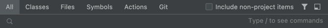

## The key(board) to success

* Basic shortcuts
  * [Search everywhere](https://www.jetbrains.com/help/idea/searching-everywhere.html) `Shift Shift`
    
  * Inspection/intention menu: `Alt + Enter`
    
    * Apply quickfix directly (where available):: `Alt + Shift + Enter`
  * Focus editor: `Escape`, close focused panel: `Shift + Escape`
  * Jump to navigation bar: `Alt + Home`
  * Find action: `Cmd + Shift + A` when you don't remember a shortcut

 
 

➡️ [NEXT](007.md)
