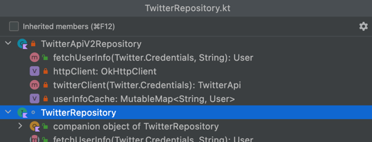

## Navigate your code

* Go to...
  * Class: `Cmd + O`
  * File: `Cmd + Shift + O`
  * Symbol: `Cmd + Alt + O`
* Recent files: `Cmd + E`
* Recent locations: `Cmd + Shift + E`
* File Structure: `Cmd + F12`
   
* Go to next error: `F2`
* Go to Declaration/usages: `Cmd + B`
* Go to Implementations: `Cmd + Alt + B`
* Go to Type declaration: `Cmd + Shift + B`
* Go to test: `Cmd + Shift + T`
* Find usages: `Alt + (Shift) + F7`

 
 

➡️ [NEXT](008.md)
